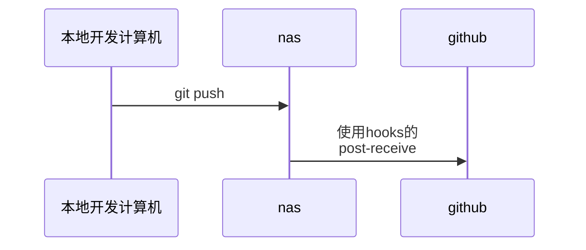

## 流程
将git-server放在本地，又将其上传到github做备份

```mermaid
  sequenceDiagram
  participant 本地开发计算机
  participant nas
  participant github
  本地开发计算机->>nas:git push
  nas->>github:使用hooks的<br>post-receive
```

commit到nas时自己手动选择，提交到GitHub时，使用hook自动化commit

## 配置
### 本地开发计算机

```bash
#到需要创建仓库的目录，建议一个项目一个仓库
git init 


```