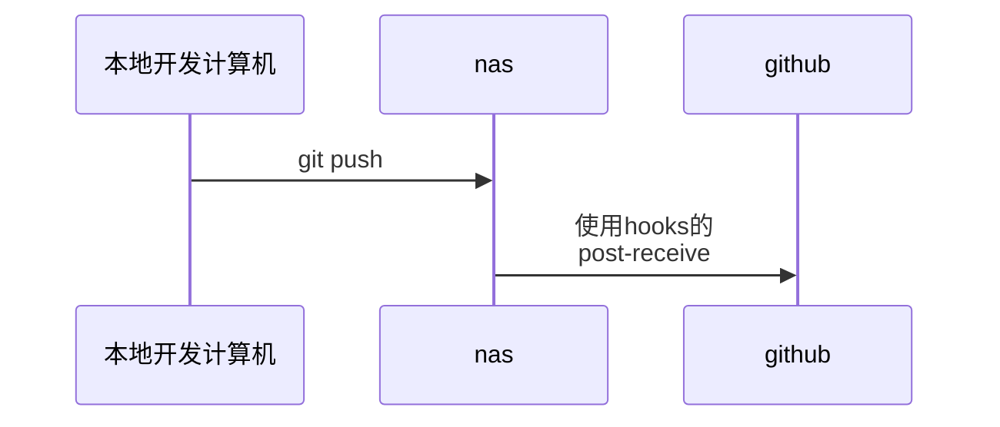
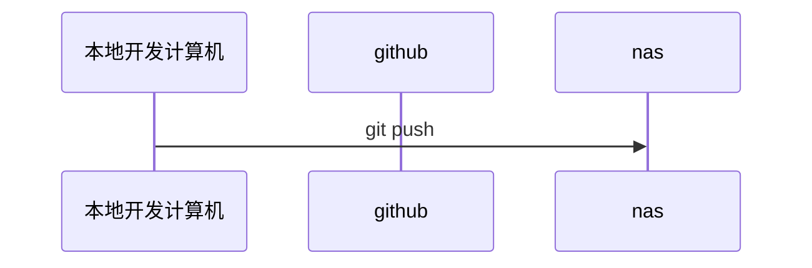

## 简述
本来是将nas的git-server作为主git服务器，将GitHub当作备份，但由于某些原因，nas没有好的环境打开


## 流程--使用nas
将git-server放在本地，又将其上传到github做备份


## 流程--直接GitHub
直接传入github

在本地计算机commit时，选择你要提交的远程仓库，如果提交到nas，nas会使用hook(post-receive)自动化提交到GitHub

## 配置
### 本地开发计算机

```bash
#到需要创建仓库的目录，建议一个项目一个仓库
#全局身份信息，建议和github账号一致，这样github上你的提交会有头像
git config --global user.name "nanliujing666"
git config --global user.email "1658988911@qq.com"

#创建仓库，也可以git clone
git init 

git remote -v

#添加一个远程仓库，如果你是clone的远程仓库，则可以不用添加这个远程仓库
git remote add 远程仓库名 url
git push -u 远程仓库名 本地分支：远程分支

#如果你想每个仓库单独一个账号，可以使用这个命令给这个项目的远程仓库添加令牌
git remote set-url 远程仓库名字 https://你的令牌@github.com/用户名/仓库名.git
#给每个域名添加一个固定的身份，之后git会让你输入账号和密码（或token）,使用这个方法url必须是纯净的，不能有令牌
git config --global credential.helper store

#为每个远程仓库分配不同的名字
git remote rename 旧名字 新名字

```

### 群晖仓库
```bash
#创建裸仓库
git init --bare
git config --global user.name "nanliujing666"
git config --global user.email "1658988911@qq.com"

git remote add github https://你的令牌@github.com/你的用户名/你的仓库名.git

```

post-receive内容
```bash
#!/bin/sh
# 自动推送已配置好的远程仓库（github）
# 前提：已在裸仓库中配置好 'github' 远程，并使用 HTTPS + PAT 认证

echo "【Auto Sync】正在推送到 GitHub..."


# 方法：直接 push（Git 允许在 bare repo 中 push 到其他 remote）
git push github --all
git push github --tags

echo "【Auto Sync】完成！"
```


