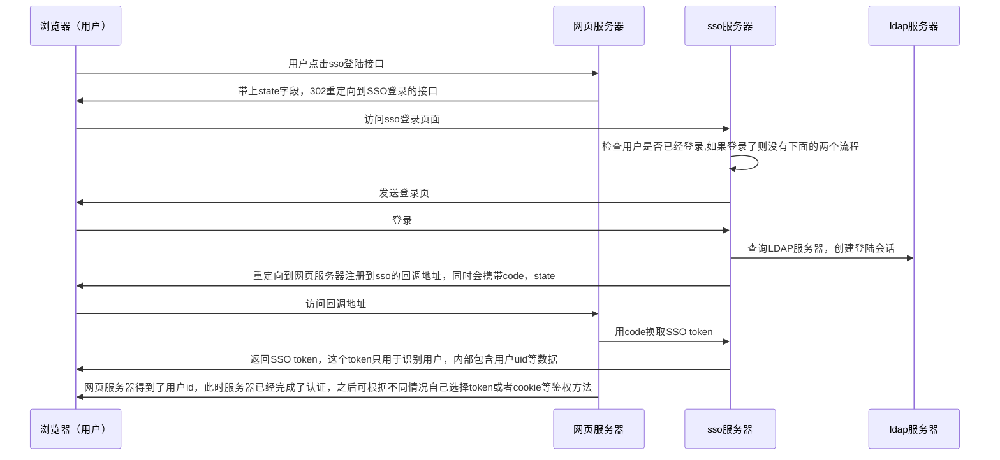

## 简述
单点登录 (Single sign-on, SSO) 是一种认证 (Authentication) 方法，允许用户使用一组凭据访问多个系统。

常用有两种SSO方式：1，基于 SAML 的 SSO；2，基于 OIDC 的 SSO。本文主要使用基于 OIDC 的 SSO。

OIDC 相比之下，建立在 OAuth 2.0 之上，提供了一种更现代的 SSO 方法。它使用JSON Web Token (JWT) 在 IdP 和 SP 之间交换身份信息，提供增强的安全性和更大的灵活性。
## 流程

## 理解
SSO登录对于网页服务器来说，其实和普通的登录没有什么区别

在正常的登录中，用户发送账号和密码，后端拿到之后要去数据库调用验证

而在SSO中，用户发过来的是code，后端需要拿到sso服务器去做验证

网页服务器需要提供两个接口，一个是登录接口，一个是回调接口。这两个接口其实对应着两个不同的登录方式，如果用户使用登录接口，就是传统登录，如果使用回调接口就是sso。在设计时，前端页面应该有一个按钮之类的东西，让用户选择。

